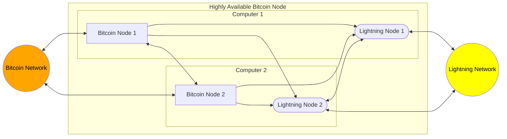
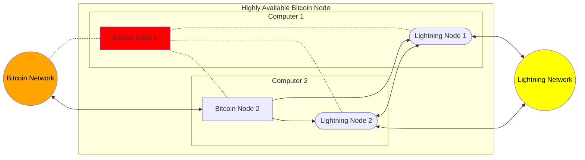
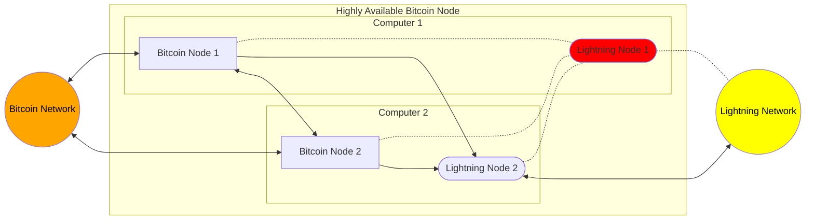
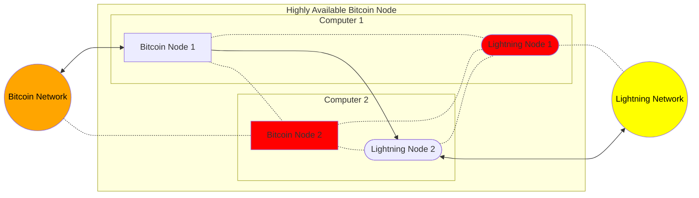
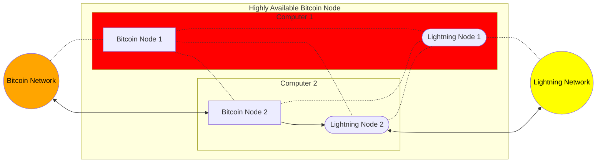
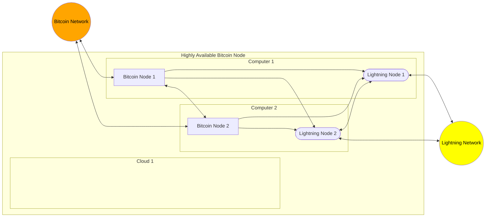
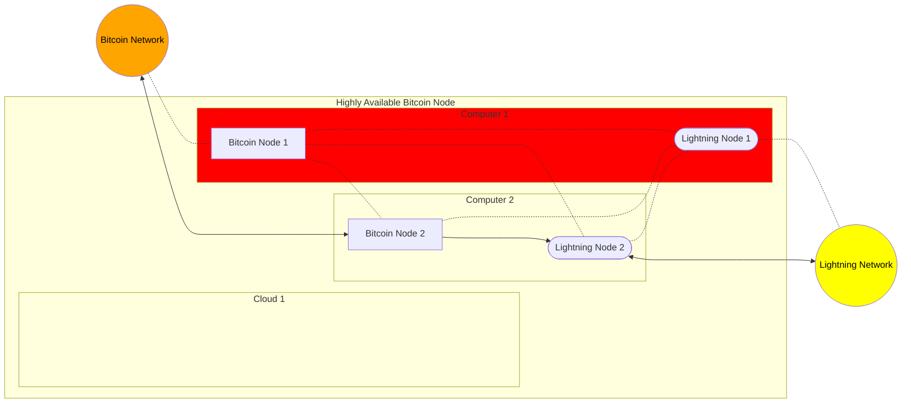
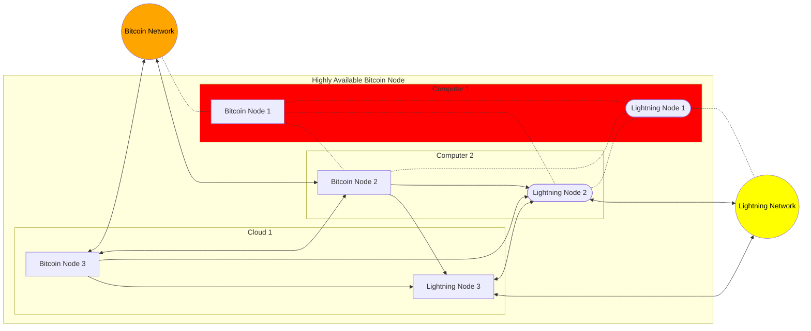

# How does a HAB Node Work?

A HAB node depends on a construct called Container Orchestration (CO for this
article), which is what Kubernetes (k8s) does. There are many good technical
introductions to this, so if you are already deeply familiar with programming
and computers, we suggest this one from
[IBM](https://www.ibm.com/cloud/learn/container-orchestration).

That said, CO is a fairly niche concept. Many of the explanations of CO or
Kubernetes do not approach the topic from first principles, either assuming deep
knowledge of how computers work (e.g. the explainer is intended for
long-established technical experts learning a new niche) or, on the contrary,
they do not have a wide enough understanding of the topic to _also_ explain or
include the _why_ and _how_ of the problem they solve in a relatable way (e.g.
"Here's how to build a k8s cluster, to solve the problem of not being as hip as
you could be").

In this explainer, we hope to avoid both of these pitfalls.

## Turing

Let's start with something that exists in reality, that everyone should be
familiar with, a cat:

Now, let's consider something else that exists in reality, a
computer:

Where do these two things overlap?

Well, for starters, the cat has the ability to see and recognize symbols, say,
of another cat. As such, it has a symbol of what a cat looks like in its mind.
We humans have this ability too, we have a symbol (albeit imperfect) of a cat,
or another human, or a computer in our head which allows us to recognize what we
are looking at. Indeed, for humans it goes far deeper than this; a human who
knows another human sufficiently well, can simulate with decent enough accuracy
what that other person would think, say, or do, given a certain premise (for
more on this see the book,
[I am a Strange Loop by Douglas Hofstadter](https://www.goodreads.com/book/show/123471.I_Am_a_Strange_Loop)).

Now, let's consider what the computer "thinks": a computer, too can think of a
computer, but not in the same way that a cat or a human think of themselves. It
has a unique property in that it can, inside itself, simulate how another
computer thinks. And this is important: it need not be a _symbol_ at all, it can
be a fully functioning computer, and it can be completely indistinguishable from
itself: an _exact_ copy.

Without diving into the nuance, this ability is achievable by any computer in
the class of computers known as Turning Complete, as defined by Alan
Turning.
[A basic Turing Machine](https://en.wikipedia.org/wiki/File:Turing_Machine_Model_Davey_2012.jpg)

Nearly all computers which can perform the simple functions of store data, read
data, and change data can do this. Even the originally conceived Turing Machine
shown above. Yes, given enough tape, it can simulate a _MacBook_. This is a very
powerful concept:

> A Turing machine is a mathematical model of computation describing an abstract
> machine that manipulates symbols on a strip of tape according to a table of
> rules. Despite the model's simplicity, it is capable of implementing any
> computer algorithm. [Wikipedia](https://en.wikipedia.org/wiki/Turing_machine)

It is so powerful it can emulate entire computers which emulate computers which
emulate computers, recursively forever (in theory, of course, in practice memory
always runs out). Which is to say, given enough tape, the above tape based
Turning Machine can emulate a MacBook which is emulating a tap computer, which
is emulating a MacBook... well, you get the idea.

The best visual example of this, of course, is
[Conway's Game of Life](https://en.wikipedia.org/wiki/Conway%27s_Game_of_Life),
a single player game that has the unique quality of also being Turing Complete,
it can emulate itself (given an infinite playing board):

<iframe width="100%" height="400vh" src="https://www.youtube-nocookie.com/embed/4lO0iZDzzXk" title="YouTube video player" frameBorder="0" allow="accelerometer; autoplay; clipboard-write; encrypted-media; gyroscope" allowFullScreen></iframe>

Computers are good at many things like word processing, social media, or playing
games, but many of these uses do not employ the computers' ability to simulate
itself. In fact, very little, historically speaking, of any consumer use cases
rely on simulating other computers. One standout use case is for security: one
container can only communicate with another container via network routing
despite living on the same physical memory chips. To this end, entire extremely
secure OSes are built where [each app is a VM](https://www.qubes-os.org/). But
when the rubber hits the road, this may completely exceed consumer threat
modeling. And rightly so, there is by and large fundamentally no need to nest
computers without extraneous reason, it is expensive and only gives you what you
already have. Emulation mostly exists as a cool, if not a bit weird, possibility
in computing.

That was, until Docker came onto the scene in 2013, and put this on its head
with one very big use case: Containerization.

## Containerization

Containers are very lightweight virtual machines. They don't emulate the entire
computer, but emulate just enough to find a good balance between form and
function. And as it turns out, they are _extremely_ useful in attempting to
solve problems of
[resource isolation and application packaging](https://www.youtube.com/watch?v=lzf9LD1unTk).
It is very easy to assign resources to a virtual computer that will never be
exceeded when that computer has no way of knowing there are more resources to
use—like one level of the game of life being unaware of any level which supports
it. What is more, packaging an application is much easier and more reliable when
all the dependencies all the way down to the OS can be included.

A container that has these declarative resources can also have defined
initialization steps. For instance, to set up a new server, generally, you would
need to install the OS, set users, set passwords, apply security measures,
update, and add services to get the box into a working state. When the box
itself is a virtual computer, you can begin to automate, remove, or simplify
steps, grouping similar work flows into what are now called "images"—an "image"
of a computer that is set up a particular way. If you want a container that will
host a website written in JavaScript, you might consider using any one of the
NodeJS images, which are fully optimized to run NodeJs scripts, adding a few
build steps to serve the website, and then saving that image. The upshot being,
if you want to replicate the container running that image, all the processes
which need to run to do so, are fully defined, easily sharable, and thus all the
difficulties of running the software are already overcome.

[Docker](https://www.docker.com/), in 2013, was the first to market that did all
the above, and a bit more, to make containerization an easy-to-use development
and operations tool. It changed the way people thought about virtualizing
computers. And consequently, it began to show where new help was now needed:
when all your apps and services were running in containers, organizing,
automating, scaling, and monitoring those containers became paramount.

Enter, orchestration.

## Orchestration

Though many companies have worked through these issues as well, Google,
[perhaps](https://www.youtube.com/watch?v=lsFDp-W1Ks0), has the longest history
and experience with orchestrating both physical machines and virtual ones.
Google launched it's first production server on cheap, expected to fail,
consumer hardware using custom fault-tolerant software.

Eventually, that idea became an internal tool called
"[Borg](https://research.google/pubs/pub43438/)".

It solved problems like:

- Making sure a container is healthy
- Making sure there are the right number of healthy containers
- Making sure these containers can talk to each other
- Making sure they are located on appropriate physical machines
- Making sure certain jobs run at certain times
- Etc

Borg was (_is_) the "secret sauce" for Google, and it is how Google delivered
all of its applicable products as highly fault-tolerant and scalable. This
became the backdrop of what is now Kubernetes, a free and open source,
orchestration tool for containers.

### Kubernetes

To put some scale on how incredible k8s is, one of the unique problems that
Kubernetes solves is scaling: adding more servers to a deployment as more
resources are demanded, or, conversely, scaling down servers as less resources
are needed. It does this by measuring how many hits a server might be getting
and then adjusting the number of containers that would service those hits. 100
hits per second might only need 2 containers, while a million hits per second
might need 10,000. A properly configured Kubernetes setup, would be able to
seamlessly spin up or down any number of new servers according to whatever the
demand was.

These numbers are not exaggerations. Attached are two great examples of how
powerful k8s is. This is k8s scaling up servers in a server farm — and then
rolling out an update while maintaining steady latency and no downtime. To be
clear, when the narrator says "servers" he is referring to containers. However,
let not the magic of Kubernetes be lost on anyone: when you watch these videos
try to imagine spinning up the stated number of _physical computers_ in _any_
amount of time. [Example 1,](https://www.youtube.com/watch?v=7TOWLerX0Ps) and
[Example 2](https://www.youtube.com/watch?v=9C6YeyyUUmI).

Kubernetes is tremendously powerful and important. In fact, we'd wager that it
is in the top 5 most important pieces of software written in the last 20 years
(along with Bitcoin and a short list of others). In summary, Kubernetes allows
you to coordinate _any set of computers_ into one single cluster—and as long as
those computers have an internet connection, they can live anywhere on _earth_.
Kubernetes is _software_ that makes applications _physical-reality-agnostic_. It
allows for hardware to completely fail, while keeping the _software_ still
running. In short, for all practical interaction with the apps that run in CO
environments, OC effectively divorces software from hardware.

Kubernetes is now the international standard for handling these problems and is
responsible for trillions in value as it supports large swaths of the legacy
internet. The Kubernetes landscape is
[presently funded](https://landscape.cncf.io/card-mode?grouping=no&sort=amount)
by a staggering $56 Billion.

Which brings us to the new internet, the peer internet, and Bitcoin.

## Bitcoin on a Highly Available Node

Collectively, CO services like Kubernetes, in solving many of the problems just
listed, become what is known as Highly Available (or High Availability): they
are very unlikely to go down under all kinds of different stress. This is where
we get the name _HA Bitcoin Node_.

In broad strokes, a HAB Node is set up and works like this:

1. A few bitcoin node-capable computers are spun up with reachable addresses.
1. They are then provisioned with Kubernetes, and their resources are cataloged,
   and health checked (they become a "cluster").
1. Many implementations and versions of Bitcoin are made into images.
1. Those images are then organized into a plan, according to operator preference
   and resources, to be used in containers on the various hosts.
1. That "plan" is given to Kubernetes, and k8s looks at its health and
   availability of its resources and does what it thinks is best in deploying
   that plan and keeping to that plan.
1. If resources are degraded, it attempts to "move" the bitcoin container(s)
   away from the degraded resource and towards the healthy ones in accordance
   with keeping the plan active.

This setup allows for dynamic and fault-tolerant node operating scenarios.

## Scenario 1

In an obvious example, where we are vastly reducing the complexity of what is
actually happening, let's say there are two host computers in the cluster. Both
are local machines. The plan is such that, on each of the local machines, a
bitcoin container and a lightning container runs, each with a full copy of the
blockchain networked together (Fig. 1).

For all Figures, ↔ represent a peer-to-peer connection and → represent a
dependency connection, and ... is a broken connection. Let's see how various
entities in the cluster can fail, yet the cluster remain available:

Fig. 1. Healthy two host HAB Node

Fig. 2. HAB Node with failed Bitcoin Node 1

Fig. 3. HAB Node with failed Lightning Node 1

Fig. 4. HAB Node with failed Lightning Node 1, and failed Bitcoin Node 2

Fig. 5. HAB Node with failed Computer 1

As you can see, the node can remain fully operational under a myriad of degraded
conditions. In fact, we can think of the above node as a 1-of-2 schema, not
dissimilar to a 1-of-2 multi-sig wallet. And this functionality dramatically
improves with more hosts added. However, we should note that this example is
primarily a static routing example, a lot more interesting options are possible
in a HAB Node, including self-healing.

## Scenario 2

In a more advanced example (but again with dramatic reductions in complexity),
let's say there are three host computers in the cluster. Of the three hosts, one
is a remote cloud server, and two are local machines. The plan is such that, on
each of the local machines, a bitcoin container with a full copy of the
blockchain and a Lightning container are running. The remote machine in the
cloud acts as compute backup, or N+1. Nothing runs on that node unless there is
an emergency, making it much cheaper to operate month to month.

Fig. 6, Healthy three Host HAB Node

To demonstrate the robustness of this model, let's now assume, in Figure 7, one
of the host machines, Computer 1, has unknown issues:

Fig. 7, Three Host HAB Node where one host fails

Kubernetes detects that there is service degradation on one of the bitcoin nodes
and/or hosts. It then notes which image is running there and starts a new
container on the third host computer with that same image, networks the
container (and new node) with its local peer, and begins to sync the blockchain.

Fig. 8, Three Host HAB Node where one host fails, but the cluster recovered full
redundancy, sans N+1

During this failure event, the node operator has no downtime with respect to
both the Bitcoin network and the Lightning network. As such, all higher level
self-hosted services which rely on high local bitcoin uptime remain unaffected.
Once the blockchain is synced, 2x redundancy is restored. Incredibly, k8s can
even go further than this. Though it may take some custom hardware or scripting,
k8s could even trigger a power cycle on the problematic host given the
appropriate amount of failed health checks.

The above would happen in real time, as an automated process, and alerting could
be forwarded so that the operator can then troubleshoot the problematic host
when available or if even needed, as opposed to **_we are actively in a
liquidity crisis fix immediately_**. Once the host is back up, Kubernetes will
start a bitcoin node on Computer 1 and once synced, remove the Bitcoin node from
the cloud, to fully remediate the incident.

You should recognize the above process as one similar to (but distinctly
different from) a different kind of multi-signature transaction: m-of-3. In the
case of a 1-of-3 wallet where up to two of the keys can be lost, yet the wallet
retains signing capabilities, we see a parallel in that 2 hosts can be down, and
we still have a working node. It is also similar to a 2-of-3 wallet where we
control two of the three keys, and a custodian controls the third. That model
has a parallel in that running a host in the cloud provides us more assurances
with our node that are hard to attain otherwise, like geographic diversity.

You will notice this model also cuts on different verticals to prevent downtime.
If we diversify Bitcoin implementations, and diversify Lightning
implementations, and, say, one implementation becomes unstable, the others can
then carry the uptime forward.

But let's not gloss over the bigger picture either:

Computer : Cluster :: Bitcoin Node : Bitcoin Network

What Kubernetes does for uptime is the _very same_ (but weaker) paradigm that
bitcoin the network at large does with this key difference: Kubernetes adds the
functionality of also centrally controlling the cluster of computers.
Thankfully, the bitcoin network doesn't have this functionality because at a
macro scale that would destroy bitcoin. Centralization of control is good when
dealing with one operator having dominion over all his machines, and bad when
one operator can have dominion over all machines in existence.

To put a Copernican Shift on it... it took the legacy tech paradigm decades,
billions of dollars of investment, and millions of hours of developer time to
achieve an imperfect, albeit incredibly powerful solution to availability in a
distributed system. Whereas Satoshi with a few years of thought, writing, and
coding created the _ideal_ solution to availability in a distributed system.

## Conclusion

As you can imagine, failure cases, host counts, host types, N+x, and a slew of
other strategies and tactics can provide unlimited scenarios to demonstrate the
capabilities and power of CO as a means of providing highly available
architecture. Indeed, the two scenarios presented here only scratch the surface.
But this is the simplified version of how a HAB Node works.

To bring the second scenario all the way back to how we first introduced
virtualization, this explanation applies directly to what a HAB Node does:

> A computer is thinking of another computer. The computer it is thinking of
> crashes. Thankfully, it was just a thought, so the computer thinks up another
> computer to replace it and carries on.

Only it's for a bitcoin node. It is, without metaphor, this (and you can see
this in an actual example [here](/blog/Case-study-1)):

> My cluster is running bitcoin node containers. One node it is running crashes.
> Thankfully, it was just a container, so my cluster spins up another container
> to replace it and carries on.

The idea of containers opened up new horizons for cloud computing. Now, it opens
up new horizons for Bitcoin and the peer to peer internet. With the realization
of HAB Nodes, we can apply billions of investment in CO underneath and in
support of the ideal bitcoin peer-to-peer solution to uptime by attaching those
solutions to the individual bitcoin node.

---

To begin building your own HAB Node, start with the Introduction to the
[Guide](/docs/Introduction/intro)
